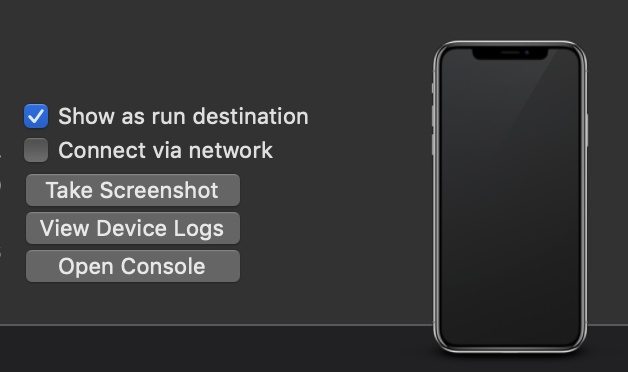

# Fundare 

Description & Purpose: 
  * Fundare helps users find their vehicles if they've forgotten where they've parked
  * The app/service works in parking lots or parking decks

Technical Specifications
  * Built Using Cross Device Framework - Flutter.io
  * Language: Dart
  * Database: Firebase Cloud Database, Firestore
  * APIs: Google Location, Google Elevation

## Fundare: Helping Lost Vehicles Find the Way Home. Built using [Flutter.io](https://flutter.io)

Fundare Flutter Development - Getting Started 

### How to Install Fundare_Flutter
1. Install Flutter & Dependencies 
   - See [How to Install Flutter](./README/FLUTTER.md)

2. Clone this repo to your machine.
   ```
   git clone https://github.com/bnonni/Fundare_Flutter
   ```

3. cd into Fundare_Flutter via Terminal, and run the following commands:
   ```
   cd app_fundare/
   flutter build ios
   ```

3. Either connect an iPhone directly to your computer or run the iOS simulator, and run the app:
  - With an iPhone connected to your computer, open Xcode and navigate to "Window > Devices & Simulators." Uncheck the "Connect via Network" option:
  
  - Disable your phone's hotspot, if one is enabled. 
  - Disable wifi on your iPhone.
  - Run the following command:
  ```
  flutter run
  ```
  - To use iOS Simulator app, simply run:
  ```
  open -a Simulator
  flutter run
  ```

That's it! :) Enjoy!

----------------------

A few resources to get you started if this is your first Flutter project:

- [Lab: Write your first Flutter app](https://flutter.dev/docs/get-started/codelab)
- [Cookbook: Useful Flutter samples](https://flutter.dev/docs/cookbook)